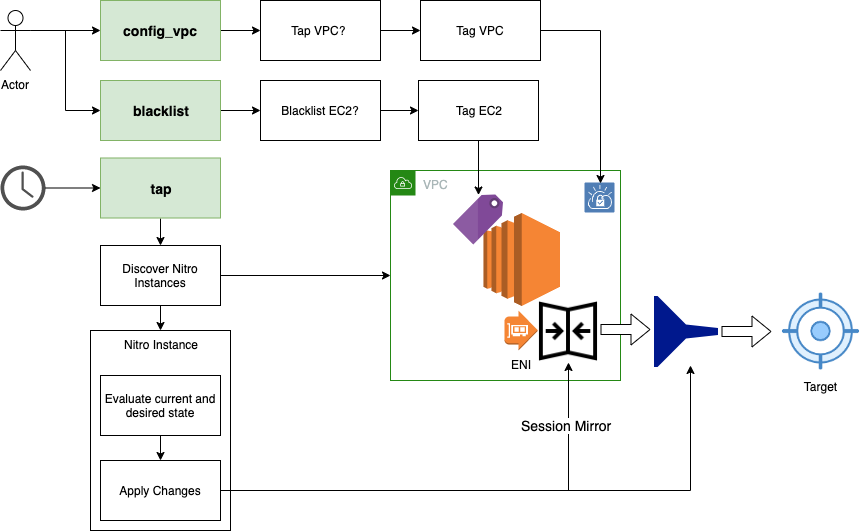

# AWS Session Mirroring Tool

This tool automates the creation and maintenance AWS Session Mirrors (Network Taps) of Nitro based EC2 instances.

| Notice: Usage of this tool can lead to significant AWS charges from the network taps created or the NLB data transfer charges. No warranty or recourse are provided. |
| --- |

What this tool solves:

- Automating the creation and removal of Session Mirrors on EC2 instances.
- 'healing' the intended state of Session Mirrors after EC2 instances are created or destroyed, when this tool is triggered or scheduled to automatically run.

The tool can selectively tap any VPCs in one AWS account, as well as tap each ENI (Elastic Network Interface) attached to an EC2.


AWS Session Mirroring Architecture


This configuration scripts (session_mirror_blacklist, session_mirror_config_vpc) do the following:

1. For each VPC that should be monitored, denote a Traffic Mirroring Target by applying AWS Tags to the VPC
1. [Optional] Create an AWS NLB (network load balancer) to be the target of Session Mirroring Traffic 
1. For each EC2 that should be blacklisted from Session Mirroring, denote that by applying AWS Tags to the EC2 instance

The runtime script (session_mirror_tap) does the following:

1. Create Session Mirroring Filters suitable for use with Vectra Cognito Detect (copy all possible traffic including DNS)
1. Discover all eligible instances (currently only Nitro based instances are supported) in each VPC, and their respective ENI's 
1. Create or remove Traffic Mirroring Sessions on each ENI using Filters





## Getting Started

### Requirements
- Python 3.6+
- virtualenv
- [AWS Credentials with appropriate permissions](https://docs.aws.amazon.com/cli/latest/userguide/cli-configure-files.html) or install them with [AWS CLI](https://aws.amazon.com/cli/)

### Setup
1. Clone this repo
```console
git clone git@github.com:vectranetworks/AWS-Session-Mirroring-Tool.git
```        
     
2. Install [AWS Credentials](https://docs.aws.amazon.com/cli/latest/userguide/cli-configure-files.html). Any method recognized by boto3 should work (~/.aws/credentials, Environment Variables)
        
3. Install the scripts
```console
python setup.py install
```

### Configuring an AWS Account for Session Mirroring
Before Session Mirroring can take place, each VPC must have a Session Mirroring Target configured. 
Any instances that should not participate (Vectra Sensor/Brain) should then be blacklisted.
This is done by applying tags inside the AWS Account.

1. Blacklist individual instances by instance id or comma separated list of instance ids:
```console
session_mirror_blacklist (Interactive)
```

2. Configure the VPCs should participate in Session Mirroring:
```console
session_mirror_config_vpc (Interactive)
```
    
### Install the Session Mirrors (Network Taps)
After configuration is complete or updated, the 'session_mirror_tap' command should be run, as well as any time an EC2 is launched or removed in the account.
This step performs the creation of the Session Mirroring instances, which will start sending traffic to the Session Mirroring Target.
If there isn't routable connectivity between the instance and the target, no traffic will arrive at the target.
```console
session_mirror_tap (Unattended)
```


## Development
1. Set up the Virtualenv
```console
./venv.sh
source .venv/bin/activate
```   

2. Run the config tools
```console
python -m aws_network_tap.config_vpc
python -m aws_network_tap.blacklist
```

3. Run the tap
```console
python -m aws_network_tap.tap
```
